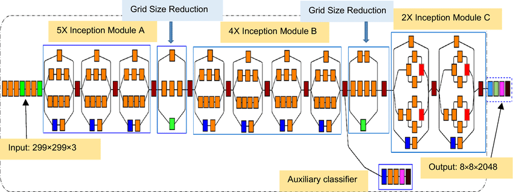
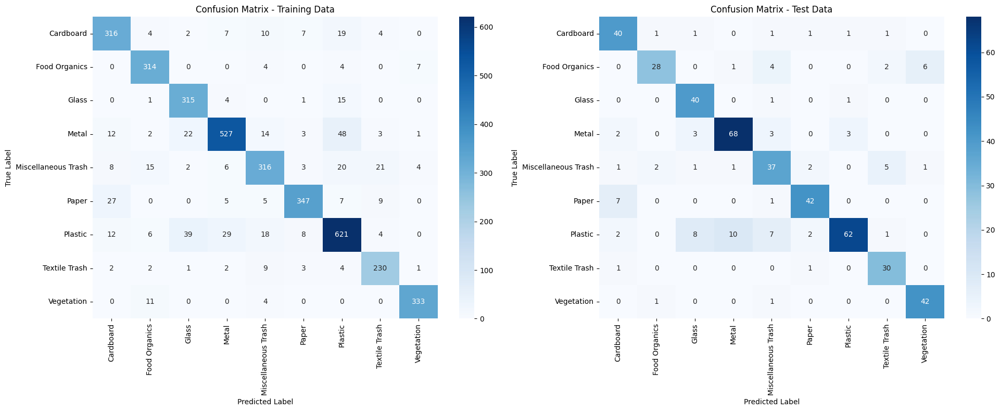
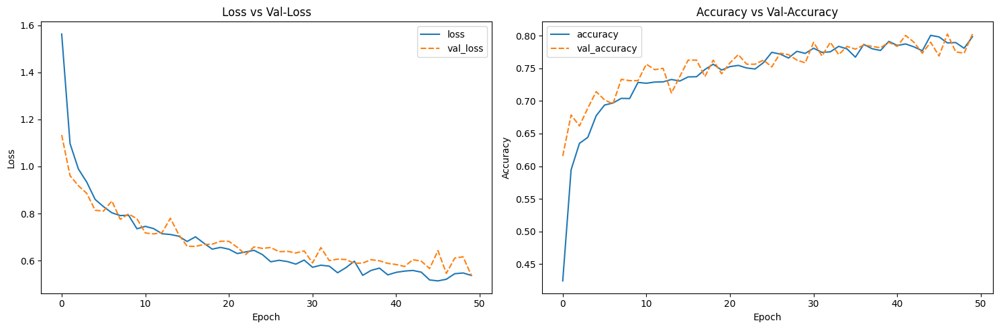

# 🗑️ Real Waste Classification CNN


<table style="width: 100%; text-align: center; border-collapse: collapse;">
    <tr>
        <th style="padding: 10px;">Dataset</th>
        <th style="padding: 10px;">Deployment</th>
        <th style="padding: 10px;">Model</th>
    </tr>
    <tr>
        <td style="padding: 10px;">
            <a href="https://archive.ics.uci.edu/dataset/908/realwaste">
                
            </a>
        </td>
        <td style="padding: 10px;">
            <a href="https://huggingface.co/spaces/amariayudha/RealWaste_Prediction_Deep_Learning">
                
            </a>
        </td>
        <td style="padding: 10px;">
            <a href="https://drive.google.com/drive/folders/174TT5ANFTS3_uztj8z8GCFGldxJErAId?usp=sharing">
                
            </a>
        </td>
    </tr>
</table>

## 🌟 Project Overview

This project focuses on developing a Convolutional Neural Network (CNN) model for classifying waste images into nine distinct material types. By automating the waste sorting process, we aim to enhance recycling efficiency and contribute to environmental sustainability.

### 🎯 Objective

Develop a deep learning-based waste classification system using a CNN that can accurately classify at least 80% of waste images across 9 material categories.

### 📊 Dataset

We utilize the [RealWaste dataset](https://archive.ics.uci.edu/dataset/908/realwaste), which contains images of waste items across 9 major material types, collected within an authentic landfill environment.

## 🗒️ Table of Contents

- [Waste Categories](#-waste-categories)
- [Features](#-features)
- [Technologies Used](#-technologies-used)
- [Installation & Usage](#-installation--usage)
- [The Brain Behind the Magic: InceptionV3](#-the-brain-behind-the-magic-inceptionv3)
- [Model Performance](#-model-performance)
- [Live Demo](#-live-demo)
- [Deployment](#-deployment)
- [Future Improvements](#-future-improvements)
- [Real-World Applications](#-real-world-applications)
- [Environmental Impact](#-environmental-impact)
- [Project Structure](#-project-structure)
- [Contributing](#-contributing)
- [License](#-license)
- [Contact](#-contact)
- [Acknowledgements](#-acknowledgements)

## 🗑️ Waste Categories

1. 📦 **Cardboard**
2. 🍾 **Glass**
3. 🥫 **Metal**
4. 📰 **Paper**
5. 🥤 **Plastic**
6. 🚮 **Miscellaneous Trash**
7. 🍎 **Food Organics**
8. 👕 **Textile Trash**
9. 🌿 **Vegetation**

## 🚀 Features

- 📊 **Exploratory Data Analysis (EDA)**: Visualizes dataset distribution and sample images.
- 🔮 **Prediction**: Classifies waste images using the trained CNN model.
- 🖥️ **Interactive Web Interface**: Built with Streamlit for easy use and deployment.
- 📈 **Performance Metrics**: Provides detailed model evaluation including accuracy, precision, recall, F1-score, and confusion matrix.
- 🔄 **Data Augmentation**: Employs techniques to increase dataset diversity and model robustness.

## 🛠 Technologies Used

-  Python
-  TensorFlow
-  Streamlit
-  Pandas
-  Plotly
-  Matplotlib
-  Seaborn
-  OpenCV

## 🖥️ Installation & Usage

1. **Clone the repository:**
   ```bash
   git clone https://github.com/yourusername/real-waste-classification-cnn.git
   ```
2. **Navigate to the project directory:**
   ```bash
   cd real-waste-classification-cnn
   ```
3. **Install required packages:**
   ```bash
   pip install -r deployment/requirements.txt
   ```
4. **Download the pre-trained model:**
   - Download the model from [Google Drive](https://drive.google.com/drive/folders/174TT5ANFTS3_uztj8z8GCFGldxJErAId?usp=sharing).
   - Place the downloaded model file into the `model/` directory.
5. **Run the Streamlit app:**
   ```bash
   streamlit run deployment/app.py
   ```
6. **Access the web application:**
   - Open your browser and navigate to `http://localhost:8501`.

## 🧠 The Brain Behind the Magic: InceptionV3

This project leverages the powerful **InceptionV3** architecture, a state-of-the-art convolutional neural network designed for both efficiency and performance.

### 🏗️ Architecture Overview

InceptionV3 is approximately **48 layers** deep and is composed of various building blocks, including:

- **Convolutions**
- **Max Pooling and Average Pooling**
- **Dropouts**
- **Fully Connected Layers**


*Diagram of the InceptionV3 architecture.*

### 🔍 Inception Modules

- **Parallel Convolutions**: Processes input data through multiple convolutional layers with different filter sizes (1x1, 3x3, 5x5) simultaneously, capturing features at various scales.
- **Dimensionality Reduction**: Uses 1x1 convolutions to reduce the number of feature maps, decreasing computational cost without losing information.

### 🏋️ Efficient Computing

- **Factorized Convolutions**: Breaks down larger convolutions into smaller, more efficient operations (e.g., a 5x5 convolution into two 3x3 convolutions).
- **Asymmetric Convolutions**: Uses combinations like 1x7 followed by 7x1 convolutions to replace a single 7x7 convolution, further reducing computation.

### 🌐 Auxiliary Classifiers

- **Improved Gradient Flow**: Incorporates auxiliary classifiers connected to intermediate layers to help mitigate the vanishing gradient problem.
- **Regularization**: Acts as an additional form of regularization during training, improving generalization.

### 📊 Parameters

- **Manageable Size**: Approximately **23.9 million parameters**, striking a balance between complexity and computational efficiency.
- **Fine-Tuning**: We fine-tuned the pre-trained InceptionV3 model on our waste classification dataset to enhance performance.

### 🔧 Customization for Waste Classification

- **Modified Output Layer**: Adjusted the final dense layer to output predictions for **9 classes** corresponding to the waste categories.
- **Data Augmentation**: Applied transformations such as rotation, flipping, zooming, and brightness adjustment to increase dataset variability.
- **Optimization Techniques**: Employed the **Adam** optimizer and **categorical cross-entropy** loss function for efficient training.

## 📊 Model Performance

The current model achieves an accuracy of **82%** on the test set. Below are detailed performance metrics:

- **Accuracy**: 0.82
- **Precision**: 0.83
- **Recall**: 0.81
- **F1-Score**: 0.82

### 📝 Class-wise Performance

| Category             | Precision | Recall | F1-Score | Support |
|----------------------|-----------|--------|----------|---------|
| Cardboard            | 0.75      | 0.87   | 0.81     | 46      |
| Food Organics        | 0.88      | 0.68   | 0.77     | 41      |
| Glass                | 0.75      | 0.95   | 0.84     | 42      |
| Metal                | 0.85      | 0.86   | 0.86     | 79      |
| Miscellaneous Trash  | 0.67      | 0.74   | 0.70     | 50      |
| Paper                | 0.88      | 0.84   | 0.86     | 50      |
| Plastic              | 0.93      | 0.67   | 0.78     | 92      |
| Textile Trash        | 0.77      | 0.94   | 0.85     | 32      |
| Vegetation           | 0.86      | 0.95   | 0.90     | 44      |


### 📉 Confusion Matrix


*Confusion matrix illustrating the model's performance across different categories.*

### 📈 Learning Curve


*Learning curve showing the model's training and validation performance over epochs.*

This plot provides insights into how the model's performance improved during the training process, helping to understand its learning dynamics and potential areas for optimization.

## 🎥 Live Demo

Our interactive demo is divided into three main sections, each serving a unique purpose in showcasing the waste classification system:

### 1. 🏠 Homepage


The homepage provides an overview of the project, including:

- Brief introduction to the waste classification problem
- Key features of our CNN model
- Quick stats on model performance
- Navigation to other sections

### 2. 📊 Exploratory Data Analysis (EDA)


The EDA section offers insights into our dataset:

- Distribution of waste categories
- Sample images from each category
- Data augmentation examples
- Key statistics about the dataset

### 3. 🔮 Prediction


The prediction section allows users to interact with our model:

- Upload or select an image of waste
- View the model's classification result
- See confidence scores for top predictions
- Compare with sample images from the predicted category

Check out our waste classification model in action! This demo shows how easy it is to navigate through different sections, explore the dataset, and get instant classification results for waste images.

## 🌐 Deployment

The project is deployed on Hugging Face Spaces. You can access it [here](https://huggingface.co/spaces/amariayudha/RealWaste_Prediction_Deep_Learning).

## 🔮 Future Improvements

From this project, you can continuously working to enhance the waste classification system. Future improvements include:

- **Object Detection**: Implementing algorithms like YOLO or Faster R-CNN to detect and classify multiple waste items within a single image.
- **Dataset Expansion**: Collecting more data to cover a wider variety of waste items and improve model generalization.
- **Advanced Architectures**: Experimenting with architectures like **EfficientNet** or **ResNeXt** for potentially improved performance.
- **Edge Deployment**: Optimizing the model for deployment on edge devices like smartphones and Raspberry Pi for real-time waste classification.
- **User Feedback Loop**: Incorporating user feedback to continually improve model accuracy and reliability.

## 💡 Real-World Applications

This waste classification system has numerous potential applications:

1. **Smart Bins**: Automating waste sorting in public spaces to improve recycling rates.
2. **Recycling Plants**: Enhancing sorting efficiency in recycling facilities, reducing manual labor.
3. **Educational Tools**: Teaching proper waste segregation in schools and communities through interactive apps.
4. **Waste Management Apps**: Integrating with mobile apps to help users properly dispose of items by scanning them.

## 🌍 Environmental Impact

By improving waste classification accuracy, this project aims to:

- **Increase Recycling Rates**: Proper sorting leads to more materials being recycled.
- **Reduce Contamination**: Minimizes contamination in recycling streams, improving the quality of recycled materials.
- **Lower Landfill Waste**: Reduces the amount of waste sent to landfills, decreasing greenhouse gas emissions.
- **Promote Circular Economy**: Encourages the reuse and recycling of materials, supporting sustainable resource management.

## 📁 Project Structure

```
real-waste-classification-cnn/
│
├── deployment/
│   ├── visualization/       # Visualization scripts and assets
│   ├── app.py               # Main Streamlit application
│   ├── eda.py               # Exploratory Data Analysis script
│   ├── prediction.py        # Prediction functionality
│   └── requirements.txt     # Deployment requirements
│
├── images/                  # Images used in README and documentation
│   ├── performance.jpg
│   ├── inceptionv3_architecture.png
│   ├── confusion_matrix.png
│   └── ...                  # Other images and diagrams
│
├── model/                   # Directory for the trained model
│   └── inceptionv3_model.h5
│
├── notebooks/
│   ├── realwaste-image-classification.ipynb         # Notebook for model training and analysis
│   └── realwaste-image-classification-inference.ipynb  # Notebook for model inference and testing
│
├── data/                    # Dataset files (if applicable)
│   └── ...                  
│
├── LICENSE                  # License file
├── README.md                # Project README
└── url.txt                  # Contains links to dataset, deployment, and model
```

## 🤝 Contributing

Contributions are welcome! Please follow these steps:

1. **Fork the repository** on GitHub.
2. **Clone your fork** locally:
   ```bash
   git clone https://github.com/yourusername/real-waste-classification-cnn.git
   ```
3. **Create a new branch** for your feature or bugfix:
   ```bash
   git checkout -b feature/your-feature-name
   ```
4. **Commit your changes** and push to your fork:
   ```bash
   git commit -am 'Add new feature'
   git push origin feature/your-feature-name
   ```
5. **Create a Pull Request** against the main repository.

Please ensure your code follows the project's coding standards and includes appropriate tests.

## 📄 License

This project is licensed under the MIT License - see the [LICENSE](LICENSE) file for details.

## 📞 Contact

**Ayudha Amari Hirtranusi**

- 🌐 **GitHub**: [github.com/ayudhaamari](https://github.com/ayudhaamari)
- 💼 **LinkedIn**: [linkedin.com/in/ayudhaamari/](https://www.linkedin.com/in/ayudhaamari/)
- 📧 **Email**: amariayudha@gmail.com

## 🙏 Acknowledgements

- [RealWaste Dataset](https://archive.ics.uci.edu/dataset/908/realwaste) creators
- [Streamlit](https://streamlit.io/) for the amazing web app framework
- [TensorFlow](https://www.tensorflow.org/) team for the powerful deep learning library
- [Keras Applications](https://keras.io/api/applications/) for providing pre-trained models

---

⭐️ If you find this project useful, please consider giving it a star!